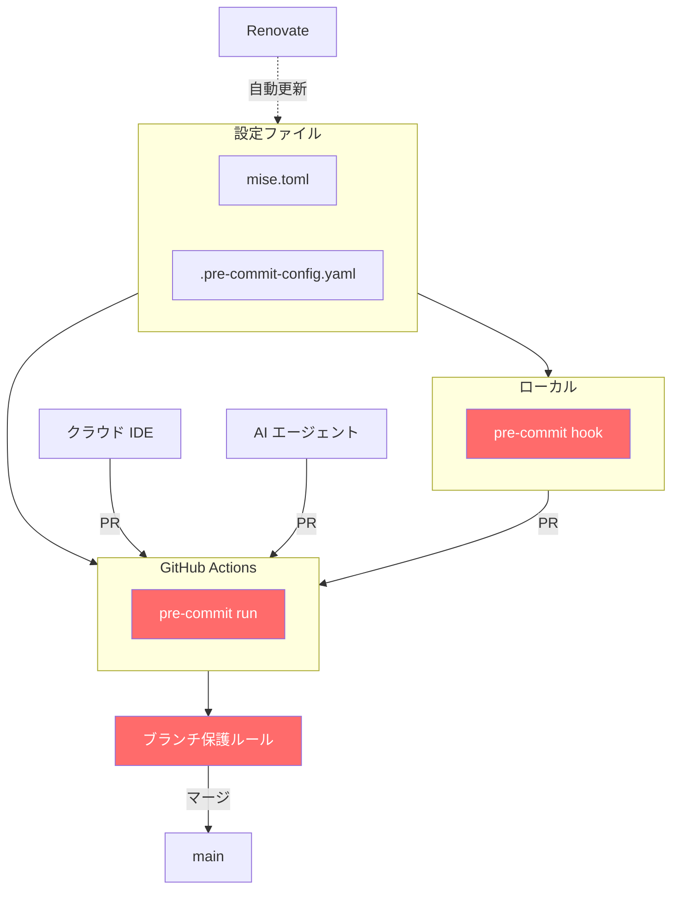

## 1. はじめに

株式会社GENDA データエンジニア / MLOps エンジニアの uma-chan です。
この記事は GENDA Advent Calendar 2025 シリーズ3 Day 6 の記事です。

@[card](https://qiita.com/advent-calendar/2025/genda)

業務上よく経験することとして、クラウド IDE からコミットしたり AI コーディングエージェントが直接 PR を作成したりするケースが増えています。
以前は例えば `.editorconfig` でローカルのエディタ設定を統一するだけで統制は取れていたと思いますが、今は編集環境が多様化してしまっているので対応が必要です。

本記事ではどこで PR を作っても同じガードレールが機能する構成を紹介します。

## 2. この記事で紹介する構成

3つのツールを組み合わせて「PR作成環境を問わない統一ガードレール」を実現します。



ポイント

- mise: ツールのバージョンを設定ファイルで一元管理
- pre-commit: ガードレールを定義。ローカルでも GitHub Actions でも同じチェックを実行
- Renovate: ガードレールを継続的に更新
- ブランチ保護ルール: 最後の砦として直接 push や force push を防止

## 3. mise: ツールバージョン管理

### 3.1. mise とは

@[card](https://mise.jdx.dev/)

mise は開発ツールのバージョンを設定ファイルで管理するツールです。
asdf の後継として開発され、より高速でシンプルな体験を提供します。

主な利点

- クロスプラットフォーム
- 多様なバックエンド (aqua, cargo, go, npm 等からもインストール可能)
- `mise install` で全員が同じ環境を再現

注意点

- バックエンドによってはビルドが必要になるので環境によってはインストールに失敗することがあります

### 3.2. インストール

```bash
curl https://mise.run | sh
```

詳細は [Installing mise](https://mise.jdx.dev/installing-mise.html) を参照してください。

### 3.3. mise.toml の書き方

```toml:mise.toml
[tools]
# パッケージマネージャ
uv = "0.9.15"

# 開発ツール
pre-commit = "4.5.0"
shellcheck = "0.11.0"

# Aqua 経由でインストールするツール
"aqua:rhysd/actionlint" = "1.7.9"
"aqua:suzuki-shunsuke/pinact" = "3.4.5"
"aqua:zizmorcore/zizmor" = "1.18.0"
"aqua:gitleaks/gitleaks" = "8.30.0"
```

仕事柄 Python と向き合うことが多いので uv を真っ先に書いていますね。
mise で uv 自体のバージョンを管理し、uv で Python のバージョンと依存関係を管理するという組み合わせでいきましょう。

## 4. pre-commit: 統一ガードレールの定義

### 4.1. pre-commit とは

@[card](https://pre-commit.com/)

pre-commit は Git hook を設定ファイルで管理するツールです。
ローカルでも GitHub Actions でも同じチェックを実行できます。

### 4.2. `repo: local` + `mise exec --` パターン

pre-commit の設定で `repo: local` を使うと、ローカルにインストールされたツールを hook として使えます。
ここに `mise exec --` を組み合わせると、mise で管理されたツールを使えます。

```yaml:.pre-commit-config.yaml
default_stages: [pre-commit]
repos:
  - repo: https://github.com/pre-commit/pre-commit-hooks
    rev: v6.0.0
    hooks:
      - id: check-json
      - id: check-yaml
      - id: detect-private-key
      - id: end-of-file-fixer
      - id: trailing-whitespace
        args: [--markdown-linebreak-ext=md]

  - repo: local
    hooks:
      - id: gitleaks
        name: Detect hardcoded secrets
        entry: mise exec -- gitleaks protect --verbose --redact --staged
        language: system
        pass_filenames: false

      - id: actionlint
        name: actionlint
        entry: mise exec -- actionlint
        language: system
        files: ^\.github/workflows/.*\.(yml|yaml)$

      - id: pinact
        name: pinact
        entry: mise exec -- pinact run
        language: system
        files: ^\.github/workflows/.*\.(yml|yaml)$

      - id: zizmor
        name: zizmor
        entry: mise exec -- zizmor
        language: system
        files: ^\.github/workflows/.*\.(yml|yaml)$

      - id: shellcheck
        name: shellcheck
        entry: mise exec -- shellcheck
        language: system
        types: [shell]

      - id: ruff-check
        name: ruff check
        entry: mise exec -- uv run --no-sync ruff check --fix
        language: system
        types: [python]

      - id: ruff-format
        name: ruff format
        entry: mise exec -- uv run --no-sync ruff format
        language: system
        types: [python]
```

### 4.3. ローカル環境での活用 (オプション)

ローカル環境で pre-commit hook を活用できます。

どの道 GitHub Actions でチェックされるので必須ではありませんが、ローカルで事前に問題を検出できるため便利です。

```bash
# pre-commit hook をインストール
pre-commit install

# これ以降、git commit 時に自動でチェックが走る
git add .
git commit -m "feat: add new feature"
# → 自動でチェックが実行される
```

GitHub Actions でチェックされる前にローカルで問題を検出できるため、開発効率が向上します。

## 5. GitHub Actions: CI でガードレールを実行

### 5.1. PR に対してチェックを実行

どの環境から PR が作られても最後の砦として GitHub Actions にて統一されたガードレールを実行します。

```yaml:.github/workflows/pre-commit.yaml
name: pre-commit
run-name: ${{ github.event_name }} on ${{ github.ref_name }} by @${{ github.actor }}

on:
  workflow_dispatch:
  push:
    branches:
      - main
  pull_request:
    branches:
      - main
    types:
      - opened
      - synchronize
      - reopened

permissions: {}

defaults:
  run:
    shell: bash

concurrency:
  group: ${{ github.workflow }}-${{ github.ref }}
  cancel-in-progress: true

jobs:
  pre-commit:
    runs-on: ubuntu-latest
    timeout-minutes: 5
    permissions:
      contents: read

    steps:
      - name: Checkout
        uses: actions/checkout@11bd71901bbe5b1630ceea73d27597364c9af683 # v4.2.2
        with:
          ref: ${{ github.event_name == 'pull_request' && github.head_ref || github.ref_name }}
          persist-credentials: false

      - name: Install mise
        uses: jdx/mise-action@f0bbb70ab00d70c9eb25f210b7a3a7cc154542a5 # v2.2.3
        with:
          install_args: --yes
          cache: true

      - name: Cache pre-commit
        uses: actions/cache@5a3ec84eff668545956fd18022155c47e93e2684 # v4.2.3
        with:
          path: ~/.cache/pre-commit
          key: pre-commit-${{ runner.os }}-${{ runner.arch }}-${{ hashFiles('.pre-commit-config.yaml') }}
          restore-keys: |
            pre-commit-${{ runner.os }}-${{ runner.arch }}-

      - name: Run pre-commit
        run: |
          mise exec -- pre-commit run --all-files
```

### 5.2. ポイント

- `jdx/mise-action` が `mise.toml` を読み取り、必要なツールを自動でインストール
- PR の作成元環境に関係なく、同じチェックが実行される
- キャッシュを活用して高速化

## 6. Renovate: 継続的な更新

### 6.1. Renovate とは

@[card](https://docs.renovatebot.com/)

Renovate は依存関係を自動更新するボットです。
mise.toml や pre-commit のバージョンも自動で更新 PR を作成してくれます。

### 6.2. 設定ファイル

```json:renovate.json
{
  "$schema": "https://docs.renovatebot.com/renovate-schema.json",
  "extends": [
    "config:recommended",
    ":enablePreCommit"
  ],
  "lockFileMaintenance": {
    "enabled": true
  }
}
```

ポイント

- `config:recommended`: 推奨設定を適用。pyproject.toml 更新時に uv.lock も一緒に更新される
- `:enablePreCommit`: pre-commit のバージョンも自動更新
- `lockFileMaintenance`: 推移的依存関係を定期的にリフレッシュ (オプション)
- mise.toml のバージョンも Renovate が自動検出して更新

## 7. ガードレールの実例

この構成で使用しているチェックツールを紹介します。

これらのガードレールはサプライチェーン攻撃対策としても有効です。詳しくは以下の記事が参考になります。

@[card](https://zenn.dev/azu/articles/ad168118524135)

### 7.1. gitleaks: シークレット検出

@[card](https://github.com/gitleaks/gitleaks)

コード内にハードコードされたシークレット (API キー、パスワード、トークンなど) を検出します。

防げる事故の例

- AI がサンプルコードを生成したとき、API キーっぽい文字列 (`API_KEY=xxx`) が含まれていた
- 環境変数をコピペしたとき、うっかり本番の認証情報が混入
- AWS 認証情報、GitHub トークン、データベース接続文字列などの漏洩

### 7.2. actionlint / pinact / zizmor: GitHub Actions セキュリティ

- actionlint: GitHub Actions ワークフローの構文チェック
- pinact: アクションのバージョンを SHA でピン留め
- zizmor: GitHub Actions のセキュリティ脆弱性を検出

@[card](https://github.com/rhysd/actionlint)
@[card](https://github.com/suzuki-shunsuke/pinact)
@[card](https://github.com/zizmorcore/zizmor)

防げる事故の例

- actionlint: `branches` を `branch` とタイポ、存在しないランナーラベルの指定
- pinact: アクションを `v1` のようなミュータブルタグで指定 → サプライチェーン攻撃のリスク (tj-actions 事件など)
- zizmor: テンプレートインジェクション脆弱性、過剰な権限設定、`pull_request_target` の危険な使用

### 7.3. shellcheck: シェルスクリプト品質

@[card](https://www.shellcheck.net/)

シェルスクリプトの一般的な問題を検出します。

### 7.4. ruff: Python Linter/Formatter

@[card](https://docs.astral.sh/ruff/)

Python コードの lint と format を高速に実行します。
`mise exec -- uv run --no-sync ruff check --fix` で uv 経由で実行できます。

## 8. ブランチ保護ルール: 最後の砦

ここまでのガードレールを設定しても、ブランチ保護ルールがなければ force push で全て無効化できてしまいます。
GitHub のリポジトリ設定でブランチ保護ルールを設定しましょう。

### 8.1. 推奨設定

Settings → Rules → Rulesets から設定できます。

- Restrict deletions: ブランチ削除を禁止
- Require a pull request before merging: PR 必須 (直接 push 禁止)
- Require status checks to pass: ステータスチェック必須 (pre-commit の CI が通らないとマージ不可)
- Block force pushes: force push 禁止

### 8.2. 防げる事故の例

- AI エージェントが main ブランチに直接 push してしまう
- レビューなしでマージされてしまう
- force push で履歴が書き換えられる
- CI をスキップしてマージされる

## 9. まとめ

ツールを組み合わせることで、PR 作成環境を問わない統一ガードレールを実現できます。

- mise: ツールバージョンの一元管理
- pre-commit: 統一されたチェックの定義
- Renovate: ガードレールの継続的な更新
- ブランチ保護ルール: 最後の砦

ローカル環境、クラウド IDE、どこから PR を作っても同じチェックが走ります。ぜひ試してみてください。
