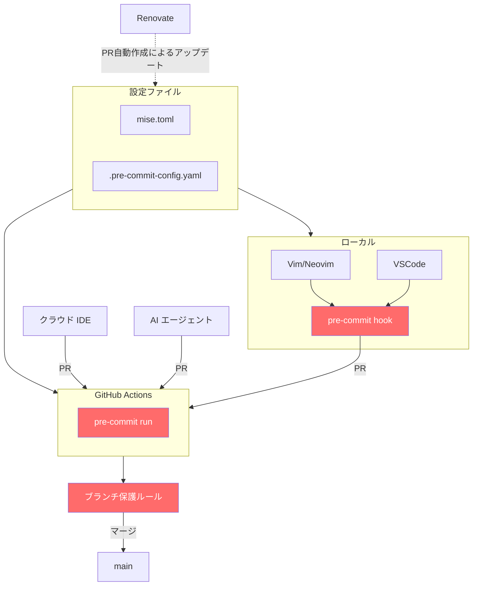

## 1. はじめに

株式会社GENDA データエンジニア / MLOps エンジニアの uma-chan です。
この記事は GENDA Advent Calendar 2025 シリーズ3 Day 6 の記事です。

@[card](https://qiita.com/advent-calendar/2025/genda)

私の業務上クラウド IDE からコミットしたり AI コーディングエージェントが直接 PR を作成したりするケースが増えています。
以前は例えば `.editorconfig` でローカルのエディタ設定を統一するだけで統制は取れていたと思いますが、今は編集環境が多様化してしまっているのでガードレールの重要性が増しています。

本記事では設定ファイルを一元管理することでメンテしやすく、かつローカルでも GitHub Actions でも同じチェックが走るガードレールの構成を紹介します。

## 2. この記事で紹介する構成



簡単に解説

- mise: ツールのバージョンを設定ファイルで一元管理
- pre-commit: ガードレールを定義。ローカルでも GitHub Actions でも同じチェックを実行
- Renovate: ガードレールを継続的に更新
- ブランチ保護ルール: 最後の砦として直接 push や force push を防止

## 3. mise

### 3.1. mise とは

@[card](https://mise.jdx.dev/)

mise は開発ツールのバージョンを設定ファイルで管理するツールです。
asdf の後継として開発されています。

主な利点

- mise.toml による宣言的なバージョン管理
- クロスプラットフォーム
- 多様なバックエンド (aqua, cargo, go, npm 等からもインストール可能)

注意点

- 任意の環境で任意のツールを動かせるわけではなく、各ツールのドキュメントに従う必要があります

### 3.2. インストール

このコマンドを実行するだけです。

```bash
curl https://mise.run | sh
```

@[card](https://mise.jdx.dev/installing-mise.html)

### 3.3. mise.toml の書き方

```toml:mise.toml
[tools]
# パッケージマネージャ
uv = "0.9.15"

# 開発ツール
pre-commit = "4.5.0"
shellcheck = "0.11.0"

# Aqua 経由でインストールするツール
"aqua:rhysd/actionlint" = "1.7.9"
"aqua:suzuki-shunsuke/pinact" = "3.4.5"
"aqua:zizmorcore/zizmor" = "1.18.0"
"aqua:gitleaks/gitleaks" = "8.30.0"
```

uv は Python のパッケージマネージャですがそれ自体も mise で管理できます。
mise で uv 自体のバージョンを管理し、uv で Python のバージョンとライブラリを管理するという組み合わせ、オススメです。

参考のために以下に雑に運用している私の mise.toml を載せておきます。
開発に必要なツールは全て mise.toml に書けるのではないかと思っています。

:::details 盛り盛り mise.toml（参考）

```toml:mise.toml
[settings]
experimental = true

[tools]
# Language Runtimes
deno  = "2.5.6"
go    = "latest"
node  = "24"
rust  = "latest"
uv    = "latest"

# CLI Tools
act             = "latest"
awscli          = "latest"
databricks-cli  = "latest"
fd              = "latest"
fzf             = "latest"
gcloud          = "latest"
gh              = "latest"
hadolint        = "latest"
jq              = "latest"
pre-commit      = "latest"
ripgrep         = "latest"
shellcheck      = "latest"
shfmt           = "latest"
terraform       = "latest"
tflint          = "latest"

# Cargo Tools
"cargo:bat" = "latest"
"cargo:rumdl" = "latest"
"cargo:tokei" = "latest"

# Aqua Tools
# "aqua:evilmartians/lefthook"  = "latest"
# "aqua:mikefarah/yq"           = "latest"
"aqua:rhysd/actionlint"          = "latest"
"aqua:suzuki-shunsuke/pinact"    = "latest"
"aqua:x-motemen/ghq"             = "latest"
"aqua:zizmorcore/zizmor"         = "latest"
"aqua:gitleaks/gitleaks"         = "latest"

# Go Tools
# "go:github.com/jameswoolfenden/pike"  = { version = "latest" }
"go:github.com/mattn/efm-langserver"  = { version = "latest" }
"go:github.com/rhysd/vim-startuptime" = { version = "latest" }
```

:::

詳細はドキュメントを参照してください。

@[card](https://mise.jdx.dev/dev-tools/)

## 4. pre-commit

### 4.1. pre-commit とは

@[card](https://pre-commit.com/)

pre-commit は Git hook (Git 操作前後に実行する処理) を設定ファイルで管理するツールです。
ローカルでも GitHub Actions でも同じチェックを実行できます。

### 4.2. `repo: local` + `mise exec --` パターン

pre-commit の設定で `repo: local` を使うと、ローカルにインストールされたツールを hook として使えます。
ここに `mise exec --` を組み合わせると、mise で管理されたツールを使えます。
この組み合わせにしておくと mise.toml の設定が反映されて、かつキャッシュを活用しやすいので GitHub Actions 上でも高速にチェックを実行できます。
とりあえずローカルで動くように書いてみて後から GitHub Actions でキャッシュが効くように調整する、という流れがスムーズです。

```yaml:.pre-commit-config.yaml
default_stages: [pre-commit]
repos:
  - repo: https://github.com/pre-commit/pre-commit-hooks
    rev: v6.0.0
    hooks:
      - id: check-json
      - id: check-yaml
      - id: detect-private-key
      - id: end-of-file-fixer
      - id: trailing-whitespace
        args: [--markdown-linebreak-ext=md]

  - repo: local
    hooks:
      - id: gitleaks
        name: Detect hardcoded secrets
        entry: mise exec -- gitleaks protect --verbose --redact --staged
        language: system
        pass_filenames: false

      - id: actionlint
        name: actionlint
        entry: mise exec -- actionlint
        language: system
        files: ^\.github/workflows/.*\.(yml|yaml)$

      - id: pinact
        name: pinact
        entry: mise exec -- pinact run
        language: system
        files: ^\.github/workflows/.*\.(yml|yaml)$

      - id: zizmor
        name: zizmor
        entry: mise exec -- zizmor
        language: system
        files: ^\.github/workflows/.*\.(yml|yaml)$

      - id: shellcheck
        name: shellcheck
        entry: mise exec -- shellcheck
        language: system
        types: [shell]

      - id: ruff-check
        name: ruff check
        entry: mise exec -- uv run --no-sync ruff check --fix
        language: system
        types: [python]

      - id: ruff-format
        name: ruff format
        entry: mise exec -- uv run --no-sync ruff format
        language: system
        types: [python]
```

### 4.3. ローカル環境での活用 (オプション)

ローカル環境で pre-commit hook を活用できます。

どの道 GitHub Actions でチェックされるので必須ではありませんが、ローカルで事前に問題を検出できるため便利です。

```bash
# pre-commit hook をインストール
mise exec -- pre-commit install

# これ以降、git commit 時に自動でチェックが走る
git add .
git commit -m "feat: add new feature"
# → 自動でチェックが実行される
```

GitHub Actions でチェックされる前にローカルで問題を検出できるため、開発効率が向上します。

AI が pre-commit hook を無視することがたまにあるのですが GitHub Actions で必ずチェックされるので安心です。

## 5. GitHub Actions

### 5.1. PR に対してチェックを実行

どの環境から PR が作られても最後の砦として GitHub Actions にて統一されたガードレールを実行します。

```yaml:.github/workflows/pre-commit.yaml
name: pre-commit
run-name: ${{ github.event_name }} on ${{ github.ref_name }} by @${{ github.actor }}

on:
  workflow_dispatch:
  push:
    branches:
      - main
  pull_request:
    branches:
      - main
    types:
      - opened
      - synchronize
      - reopened

permissions: {}

defaults:
  run:
    shell: bash

concurrency:
  group: ${{ github.workflow }}-${{ github.ref }}
  cancel-in-progress: true

jobs:
  pre-commit:
    runs-on: ubuntu-latest
    timeout-minutes: 5
    permissions:
      contents: read

    steps:
      - name: Checkout
        uses: actions/checkout@8e8c483db84b4bee98b60c0593521ed34d9990e8 # v6.0.1
        with:
          persist-credentials: false

      # mise.toml で定義したツールをキャッシュ
      # mise.toml が変わったらキャッシュを破棄
      - name: Install mise
        uses: jdx/mise-action@146a28175021df8ca24f8ee1828cc2a60f980bd5 # v3.5.1
        with:
          install_args: --yes  # 確認プロンプトをスキップ
          cache: true

      # pre-commit が hook ごとに作る仮想環境をキャッシュ
      # .pre-commit-config.yaml が変わったらキャッシュを破棄
      # restore-keys を設定すると古いキャッシュから差分更新できるが、
      # ゴミが溜まりやすいのでここではクリーンインストールを優先
      - name: Cache pre-commit
        uses: actions/cache@0057852bfaa89a56745cba8c7296529d2fc39830 # v4.3.0
        with:
          path: ~/.cache/pre-commit
          key: |
            pre-commit-${{ runner.os }}-${{ runner.arch }}-${{ hashFiles('.pre-commit-config.yaml') }}

      - name: Run pre-commit
        run: |
          mise exec -- pre-commit run --all-files
```

### 5.2. ポイント

- `jdx/mise-action` が `mise.toml` を読み取り、必要なツールを自動でインストール
- PR の作成元環境に関係なく、同じチェックが実行される
- キャッシュを活用して高速化

### 5.3. テストもガードレールに含める

pre-commit による lint に加えて、テストもガードレールとして追加できます。
別ジョブとして定義し、集約ジョブでまとめてブランチ保護ルールで必須にします。

```yaml
  test:
    runs-on: ubuntu-latest
    timeout-minutes: 10
    permissions:
      contents: read

    steps:
      - name: Checkout
        uses: actions/checkout@8e8c483db84b4bee98b60c0593521ed34d9990e8 # v6.0.1
        with:
          persist-credentials: false

      - name: Install mise
        uses: jdx/mise-action@146a28175021df8ca24f8ee1828cc2a60f980bd5 # v3.5.1
        with:
          install_args: --yes
          cache: true

      - name: Install dependencies
        run: |
          mise exec -- uv sync

      - name: Run tests
        run: |
          mise exec -- uv run pytest

  # 集約ジョブ: ブランチ保護ルールではこのジョブを必須に設定
  # matrix でジョブが増減しても設定変更が不要になる
  ci:
    needs: [pre-commit, test]
    if: always()
    runs-on: ubuntu-latest
    timeout-minutes: 5
    permissions: {}
    steps:
      - name: Check results
        run: |
          if [[ "${{ contains(needs.*.result, 'failure') }}" == "true" ]]; then
            echo "One or more jobs failed"
            exit 1
          fi
          if [[ "${{ contains(needs.*.result, 'cancelled') }}" == "true" ]]; then
            echo "One or more jobs were cancelled"
            exit 1
          fi
          echo "All checks passed"
```

## 6. Renovate

### 6.1. Renovate とは

@[card](https://docs.renovatebot.com/)

Renovate は依存関係を自動更新するボットです。
mise.toml や pre-commit のバージョンも自動で更新 PR を作成してくれます。

### 6.2. 設定ファイル

```json:renovate.json
{
  "$schema": "https://docs.renovatebot.com/renovate-schema.json",
  "extends": [
    "config:recommended",
    ":enablePreCommit"
  ],
  "lockFileMaintenance": {
    "enabled": true
  }
}
```

ポイント

- `config:recommended`: 推奨設定を適用。mise.toml をはじめとして色々と更新対象としてくれる。
- `:enablePreCommit`: pre-commit のバージョンも自動更新
- `lockFileMaintenance`: 推移的依存関係を定期的にリフレッシュ (オプション)

## 7. ガードレールの実例

この構成で使用しているチェックツールを紹介します。

これらのガードレールはサプライチェーン攻撃対策としても有効です。詳しくは以下の記事が参考になります。

@[card](https://zenn.dev/azu/articles/ad168118524135)

### 7.1. gitleaks

@[card](https://github.com/gitleaks/gitleaks)

コード内にハードコードされたシークレット (API キー、パスワード、トークンなど) を検出します。

防げる事故の例

- AI がサンプルコードを生成したとき、API キーっぽい文字列 (`API_KEY=xxx`) が含まれていた
- 環境変数をコピペしたとき、うっかり本番の認証情報が混入
- AWS 認証情報、GitHub トークン、データベース接続文字列などの漏洩

### 7.2. actionlint / pinact / zizmor

- actionlint: GitHub Actions ワークフローの構文チェック
- pinact: アクションのバージョンを SHA でピン留め
- zizmor: GitHub Actions のセキュリティ脆弱性を検出

@[card](https://github.com/rhysd/actionlint)
@[card](https://github.com/suzuki-shunsuke/pinact)
@[card](https://github.com/zizmorcore/zizmor)

防げる事故の例

- actionlint: `branches` を `branch` とタイポ、存在しないランナーラベルの指定
- pinact: アクションを `v1` のようなミュータブルタグで指定 → サプライチェーン攻撃のリスク (tj-actions 事件など)
- zizmor: テンプレートインジェクション脆弱性、過剰な権限設定、`pull_request_target` の危険な使用

### 7.3. shellcheck

@[card](https://www.shellcheck.net/)

シェルスクリプトの一般的な問題を検出します。

### 7.4. ruff

@[card](https://docs.astral.sh/ruff/)

Python コードの lint と format を高速に実行します。
`mise exec -- uv run --no-sync ruff check --fix` のように uv 経由で実行できます。

## 8. ブランチ保護ルール ～最後の砦～

ここまでのガードレールを設定しても、ブランチ保護ルールがなければ force push で全て無効化できてしまいます。
GitHub のリポジトリ設定でブランチ保護ルールを設定しましょう。

### 8.1. 推奨設定

Settings → Rules → Rulesets から設定できます。

- Restrict deletions: ブランチ削除を禁止
- Require a pull request before merging: PR 必須 (直接 push 禁止)
- Require status checks to pass: ステータスチェック必須。5.3 で紹介した集約ジョブ (`ci`) を指定すると、lint とテスト両方の成功が必須になる
- Block force pushes: force push 禁止

### 8.2. 防げる事故の例

- AI エージェントが main ブランチに直接 push してしまう
- レビューなしでマージされてしまう
- force push で履歴が書き換えられる
- CI をスキップしてマージされる

## 9. まとめ

設定ファイルの一元管理ができていることによって、ローカルで動くように書いた後に GitHub Actions で動くように調整するのが楽なガードレールの構成を紹介しました。参考になれば幸いです。
